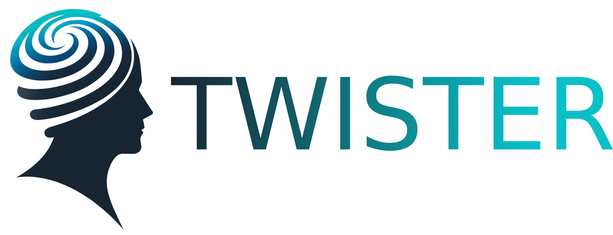

<div align="center">


<p align="center">
  
</p>


[📚Documentation]() |
[💡DEMOS]() |
[🛠️ Installation]() |
[🌎 Home Page]() |
[🚨 News]() |
[🪲 Reporting Issues](https://github.com/peach-lucien/twister)


[](https://twitter.com/RobertPeach15)

</div>

# Welcome! 👋


**TWISTER** is a library for analysing and estimating Dystonia. It estimates the **T**oronto **W**estern **S**pasmodic **T**orticollis **R**ating Scale.  

To receive updates on code releases, please 👀 watch or ⭐️ star this repository!

``twister`` is an automated computer vision method that tracks the head and pose movements of dytonia patients.
It can condense complex movements into features that capture disease severity.

# Installation


Follow these steps to install [Project Name] on your system.

### Prerequisites

Before you begin, ensure you have met the following requirements:
- [Python](https://www.python.org/downloads/) 3.6+ (if your project is Python-based)
- [Git](https://git-scm.com/downloads)
- Other dependencies...

### Cloning the Repository

To install [Project Name], clone the repository to your local machine:

```bash
git clone https://github.com/peach-lucien/twister.git
cd twister
pip install -e .
```

Please also download the appropriate models from the dataverse with:

```bash
python post_install.py
```
Linux users, make sure that the ffmpeg is not installed via Conda. If you have multiple versions of ffmpeg it may point towards the wrong one. You can remove this with:
```conda remove --force ffmpeg```

# Demos

Explore the `./examples/` directory to find a variety of examples demonstrating the capabilities and usage of [Project Name]. These examples are designed to help you get started and to showcase the features of the project.

## Getting Started

To run an example, navigate to the `examples` directory and execute the desired script. For instance:

```bash
cd examples/intro_examples/
python run_ex_introduction.py
```

# Reference

- 📄 **Preprint September 2023**:
  [Quantitative assessment of head movement dynamics in dystonia using visual perceptive deep learning: a multi-centre retrospective longitudinal cohort study.](https://www.medrxiv.org/content/10.1101/2023.09.11.23295260v1)
  Robert Peach*, Maximilian Friedrich*, ... , Chi Wang Ip.

# License

This project is licensed under the MIT License - see the [LICENSE](LICENSE) file for details.

